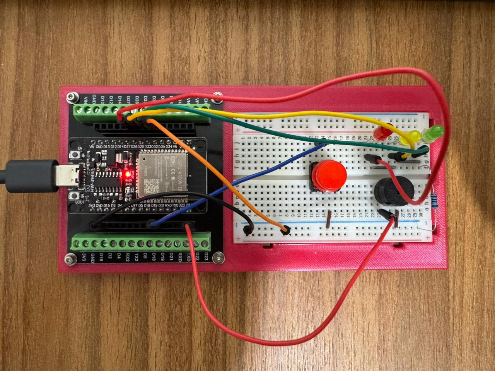

# Gate Alarm for Dogs

An ESP32-based gate alarm that helps prevent dogs from escaping when the gate is left open.

The system watches a gate-closed switch, waits 10 seconds after the gate opens, and then starts an audible alarm. It also supports a temporary silence button, visual status LEDs, and deep sleep to reduce battery drain while the gate is closed.

## Hardware

- ESP32-WROOM-32D development board
- 1 gate sensor or push button
- 1 silence button
- 1 active buzzer
- 1 green LED
- 1 yellow LED
- 1 red LED
- 1 resistor for the LEDs, `220 ohm` in the current build

## Pin Mapping

- `GPIO33`: gate sensor input
- `GPIO19`: silence button input
- `GPIO25`: green LED
- `GPIO26`: yellow LED
- `GPIO27`: red LED
- `GPIO23`: active buzzer

`GPIO33` is used because it is an RTC-capable pin and can wake the ESP32 from deep sleep when the gate opens.

## Wiring

### Gate sensor

The sketch uses `INPUT_PULLUP`, so the input is internally pulled high.

- One side of the gate switch goes to `GPIO33`
- The other side goes to `GND`

Logic:

- switch pressed or closed to ground = gate closed
- switch released or open circuit = gate open

### Silence button

- One side of the button goes to `GPIO19`
- The other side goes to `GND`

### LEDs

This build uses a single shared resistor on the LED ground return, based on the tested behavior of the current sketch where the LEDs are not expected to be on together during normal operation.

- `GPIO25` -> green LED anode
- `GPIO26` -> yellow LED anode
- `GPIO27` -> red LED anode
- green, yellow, and red LED cathodes tied together
- shared cathode line -> `220 ohm` resistor -> `GND`

### Active buzzer

- buzzer `+` -> `GPIO23`
- buzzer `-` -> `GND`

If your buzzer draws more current than an ESP32 GPIO should provide, drive it through a transistor instead of connecting it directly.

## Behavior

### Gate opened

- the red LED blinks twice
- after the red blink sequence finishes, the 10-second countdown starts
- while the gate remains open and the alarm is not sounding, the yellow LED blinks once per second

### Gate closed

- the green LED blinks twice
- the countdown stops
- the buzzer is turned off

### Silence button

When the gate is open:

- pressing the silence button immediately suppresses the alarm
- the green LED blinks three times
- after the third blink, the silence timer starts
- when the silence period ends, the alarm returns immediately if the gate is still open

When the gate is closed:

- pressing the silence button has no practical effect on the current alarm flow

### Alarm output

- the active buzzer pulses on and off
- the red LED follows the same rhythm as the buzzer

## Deep Sleep

To reduce power consumption:

- the ESP32 enters deep sleep shortly after the gate is closed and the system is idle
- the ESP32 wakes up when the gate opens
- wakeup uses `EXT0` on `GPIO33`

The sketch prints these messages to the Serial Monitor at `115200` baud:

- `Normal boot`
- `Entering deep sleep`
- `Woke up from deep sleep because the gate opened`

On most ESP32 development boards, the `PWR` LED stays on even while the ESP32 itself is in deep sleep. That LED is usually tied to board power, not to the ESP32 sleep state.

## Battery Notes

This project works best with a proper battery and power design. A standard ESP32 development board wastes more power than the ESP32 module alone because of:

- the power LED
- the USB-to-serial chip
- the on-board regulator

For a quick prototype, the development board is fine. For long battery life, a custom low-power design is better.

Important notes:

- do not connect a single Li-ion cell directly to `3V3`
- powering a Li-ion cell directly into `VIN` may work, but it is not the most reliable option for all boards
- if battery life matters, consider a dedicated 3.3 V regulator and a protected battery pack

## Arduino IDE

1. Open `AlarmWithTimer.ino` in Arduino IDE.
2. Select your ESP32 board.
3. Compile and upload.
4. Open Serial Monitor at `115200` baud if you want to confirm deep sleep and wakeup behavior.

## Tuning

Timing values are declared at the top of the sketch:

- `GATE_OPEN_TIMEOUT_MS`
- `SILENCE_TIME_MS`
- `DEBOUNCE_TIME_MS`
- `EVENT_BLINK_STEP_MS`
- `YELLOW_BLINK_INTERVAL_MS`
- `YELLOW_LED_ON_TIME_MS`
- `ALARM_TOGGLE_INTERVAL_MS`
- `SLEEP_ARM_DELAY_MS`
